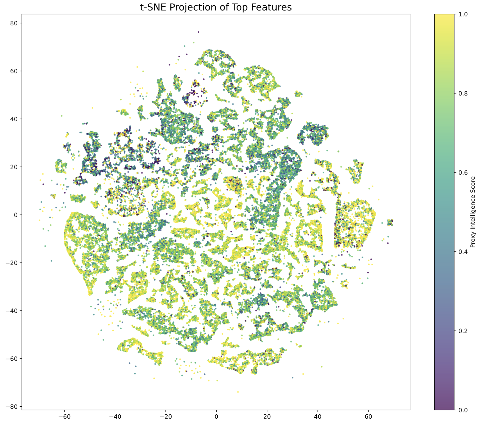

# Project Repository

Analysis of the large OkCupid dataset from Kirkegaard and Bjerrekær. 

Write-up here https://www.overleaf.com/read/yhpmwqsydbvs#4e3fbe

## Prerequisites
- **Git LFS**: This repository uses Git Large File Storage (LFS) to manage large `.npy` files. You must install Git LFS before cloning the repository.  
  Download and install it from [https://git-lfs.com/](https://git-lfs.com/).  
  After installation, run `git lfs install` in your terminal.

## Repository Structure
- **`notebooks/`**: Contains Jupyter notebooks where exploratory work and analysis were performed.
- **`scripts/`**: Contains reproducible Python scripts for processing and analyzing data.  
  - Scripts read from `outputs/` but write to `scripts/outputs/`.  
  - You can run dimension reduction scripts without first running imputation scripts, as imputed data is already included in the repository.
- **`outputs/`**: Contains pre-computed outputs (e.g., imputed data) used by the scripts.  
  - Note: Some `.npy` files were accidentally committed directly to the repo but are now tracked using Git LFS, making the repo a few GB in size.

## Dependencies
- We ran `pip freeze > requirements.txt` and `conda env export > environment.yml`. These files can be used to set up the environment to run the scripts. 
- The notebooks use the RAPIDS cuML library for GPU-accelerated machine learning.  
  - A `conda_setup` file is included with helpful commands for setting up the environment, but this is **not required** for running the scripts.
